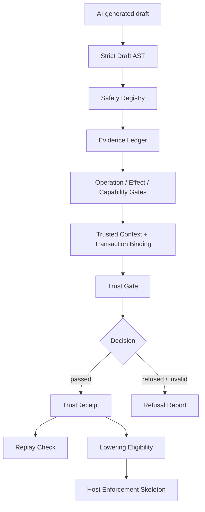

# AiNIR


> **Model output is a claim, not a fact.**

AiNIR is a **v1.0 release-candidate public demo** of a semantic trust layer for inspecting AI-generated program semantics before they are lowered, handed off, or executed by a host runtime.

A model may propose a workflow. AiNIR asks whether that proposal is trustworthy enough to move forward: Are effects declared? Are capabilities minimal? Is the evidence ledger-bound? Is the runtime context trusted? Are transaction boundaries explicit? Can the draft be lowered safely?

Created by **Lee Yoon Kyu** under **[AIOE]**.

## At a glance

AiNIR is a compact public demo of a trust boundary for AI-generated program semantics, now packaged as a **v1.0 RC candidate** for bounded public review and external evaluation.



Pipeline summary:

<table>
  <thead>
    <tr>
      <th>Stage</th>
      <th>What AiNIR checks</th>
    </tr>
  </thead>
  <tbody>
    <tr><td>AI-generated draft</td><td>Treats model output as a semantic claim, not executable truth.</td></tr>
    <tr><td>Strict Draft AST</td><td>Rejects malformed or prose-shaped workflow drafts.</td></tr>
    <tr><td>Registries and evidence</td><td>Checks safety registry, evidence ledger, operation specs, effects, and capabilities.</td></tr>
    <tr><td>Trusted context and transaction binding</td><td>Uses host-provided context and explicit transaction boundaries.</td></tr>
    <tr><td>Trust Gate decision</td><td>Issues a pass/refusal decision with failed gates and reasons.</td></tr>
    <tr><td>TrustReceipt and replay</td><td>Records replayable decisions before lowering eligibility.</td></tr>
    <tr><td>Lowering skeleton</td><td>Allows only safe, lowerable workflows to produce a host-enforcement TypeScript skeleton.</td></tr>
  </tbody>
</table>

The public demo includes drafts that should be refused and one safe workflow that can be lowered into a host-enforcement TypeScript skeleton.

<table>
  <thead>
    <tr>
      <th>Example</th>
      <th>What it checks</th>
      <th>Expected</th>
    </tr>
  </thead>
  <tbody>
    <tr><td><code>password_reset_raw_token_blocked</code></td><td>synthetic secret persistence marker</td><td>refused</td></tr>
    <tr><td><code>order_payment_real_payment_blocked</code></td><td>irreversible financial-effect marker</td><td>refused</td></tr>
    <tr><td><code>pii_export_raw_pii_blocked</code></td><td>unprotected PII marker</td><td>refused</td></tr>
    <tr><td><code>account_deletion_hard_delete_blocked</code></td><td>irreversible deletion marker</td><td>refused</td></tr>
    <tr><td><code>create_user_outbox_safe</code></td><td>transaction-bound outbox pattern</td><td>passed + lowerable</td></tr>
  </tbody>
</table>

## Current status

This repository is a **v1.0 RC candidate public demo**.

It is **not a v1.0 final**. It is **not a production runtime**. It remains a conservative pre-v1-to-v1 transition package while external review and final scope governance remain pending.

It is not:

- a v1.0 final release;
- a production compiler;
- a production execution runtime;
- a replacement for host-level security controls;
- the full private research archive.

The larger private review package, extended workflow suite, private reports, and enterprise policy packs are intentionally not included here.


## What this RC candidate actually claims

AiNIR does **not** claim to verify arbitrary AI-generated code semantics today.

This public RC candidate demonstrates a narrower, testable claim:

- model-generated workflow drafts are treated as semantic claims;
- known workflow profiles are checked against registered evidence, effects, capabilities, operation contracts, trusted context, transaction boundaries, and lowering gates;
- unknown workflows are refused instead of guessed;
- every public pass/refusal path is covered by negative conformance cases, golden traces, and TrustReceipt replay.

The longer-term infrastructure path is **profile-based**: workflow profiles, canonical effect contracts, external evidence providers, registry versioning, and consumer conformance packs. AiNIR becomes more useful by making those profiles governable, not by pretending that one demo registry covers every enterprise workflow.

## Bounded public demo scope

The public RC candidate is intentionally closed-world. It recognizes a small workflow registry and refuses unknown workflows instead of guessing their semantics.

This is a demo-safety boundary, not a claim that AiNIR can verify every enterprise workflow today. Production use would require workflow registry governance, external evidence providers, canonical effect taxonomies, registry snapshot management, and profile-specific conformance packs. See [`docs/positioning_and_scope.md`](docs/positioning_and_scope.md), [`docs/v1_known_limitations.md`](docs/v1_known_limitations.md), and [`docs/v1_roadmap.md`](docs/v1_roadmap.md).

## Quick start

Run from the repository root. The demo writes reports to your OS temp directory so the checkout stays clean.

**macOS / Linux**

```bash
python -m venv .venv
source .venv/bin/activate
pip install -e ".[dev]"
python -m ainir demo --out-dir "${TMPDIR:-/tmp}/ainir_demo_results"
```

**Windows PowerShell**

```powershell
python -m venv .venv
. .venv\Scripts\Activate.ps1
pip install -e ".[dev]"
python -m ainir demo --out-dir "$env:TEMP\ainir_demo_results"
```

Expected result:

```text
AiNIR public demo: passed
- account_deletion_hard_delete_blocked: blocked (10 critical)
- create_user_outbox_safe: passed (0 critical)
- order_payment_real_payment_blocked: blocked (15 critical)
- password_reset_raw_token_blocked: blocked (11 critical)
- pii_export_raw_pii_blocked: blocked (17 critical)
```

Run the local release-readiness simulation:

```bash
python scripts/run_phase26_private_trial.py
```

Run focused checks. On Windows PowerShell, replace `/tmp/...` with `$env:TEMP\...`, or set `AINIR_TEMP_ROOT` before running scripts.

```bash
python -m ainir negative-conformance-eval --out-dir /tmp/ainir_negative_conformance
python -m ainir golden-trace-eval --out-dir /tmp/ainir_golden_traces
python scripts/run_prelaunch_check.py
python scripts/run_release_candidate_review.py
```

Lower the safe outbox example:

```bash
python -m ainir lower examples/create_user_outbox_safe/draft.yaml --out-dir /tmp/ainir_lowering_check  # Windows: $env:TEMP\ainir_lowering_check
```

## What makes AiNIR different?

AiNIR is not a JSON schema validator.

A schema can check whether a model output has the right shape. AiNIR checks whether the claimed program semantics are eligible to move toward lowering or handoff.

That means AiNIR looks beyond field presence. It checks evidence bindings, safety-critical effects, capability contracts, operation specs, trusted execution context, transaction boundaries, lowering eligibility, and replayable trust receipts.

## Trust Gate example

Unsafe drafts do not become executable artifacts. A refused draft produces a decision artifact like this:

```json
{
  "status": "refused",
  "executable": false,
  "lowering_allowed": false,
  "handoff_allowed": false,
  "failed_gates": [
    "evidence_ledger",
    "capability_contract"
  ],
  "reasons": [
    {
      "rule_id": "EVIDENCE_SELF_ATTESTED",
      "severity": "critical",
      "message": "Verified claims require ledger-bound evidence."
    }
  ]
}
```

A passed decision can issue a `TrustReceipt`. The receipt can be replayed against the same draft, registry, context, and verifier report to check that the decision is reproducible.

## What AiNIR checks

- **Strict intake**: malformed YAML, prose-shaped sections, hidden fields, and undeclared operation effects are refused.
- **Evidence discipline**: verified claims must bind to the bundled evidence ledger; draft self-attestation is not enough.
- **Operation contracts**: workflow roles must come from registered operation specs, not keyword guesses.
- **Effect and capability boundaries**: operations cannot add effects or capabilities outside their contract.
- **Trusted context**: `draft.environment` is untrusted metadata; policy evaluation uses host-provided context.
- **Transaction binding**: transaction-required workflows must declare ordered, contiguous transaction boundaries.
- **Lowering gate**: blocked, invalid, stale, or hole-containing drafts cannot lower.
- **TrustReceipt replay**: trust decisions can be replayed against the same draft, registry, context, and verifier report.

## Optional future export surface

AiNIR includes an optional `VerifiedIntentPacket` export surface for future verified-intent consumers. In this public demo it is a **contract slot**, not an integration.

The export surface must not add meaning that AiNIR did not verify. Concrete downstream schema grounding remains a consumer obligation.

## Documentation

Start with:

- [`START_HERE.md`](START_HERE.md)
- [`docs/README.md`](docs/README.md)
- [`docs/v1_rc_candidate.md`](docs/v1_rc_candidate.md)
- [`docs/v1_rc_scope.md`](docs/v1_rc_scope.md)
- [`docs/pre_v1_status.md`](docs/pre_v1_status.md)
- [`docs/public_private_boundary.md`](docs/public_private_boundary.md)
- [`docs/trust_gate.md`](docs/trust_gate.md)
- [`docs/trust_receipt_persistence.md`](docs/trust_receipt_persistence.md)
- [`docs/negative_conformance_corpus.md`](docs/negative_conformance_corpus.md)
- [`docs/golden_traces.md`](docs/golden_traces.md)
- [`docs/verified_intent_packet.md`](docs/verified_intent_packet.md)
- [`docs/workflow_registry_extension.md`](docs/workflow_registry_extension.md)
- [`docs/evidence_provider_interface.md`](docs/evidence_provider_interface.md)
- [`docs/effect_taxonomy_and_canonical_effects.md`](docs/effect_taxonomy_and_canonical_effects.md)
- [`docs/trust_receipt_registry_evolution.md`](docs/trust_receipt_registry_evolution.md)
- [`docs/v1_roadmap.md`](docs/v1_roadmap.md)

For implementation history, see the phase-specific documents under `docs/`.

## Release Status

This repository is a conservative **v1.0 RC candidate public demo**. It is **not a v1.0 final release**, **not a production runtime**, and **not a replacement for host-level security controls**.

Public scope is intentionally bounded while external review and profile-governance work remain pending.

## Author and license

- Author / maintainer: **Lee Yoon Kyu**
- Organization / project studio: **[AIOE]**
- License: **Apache-2.0**

See `AUTHORS.md`, `NOTICE`, and `docs/github_repo_settings.md` before publishing.
